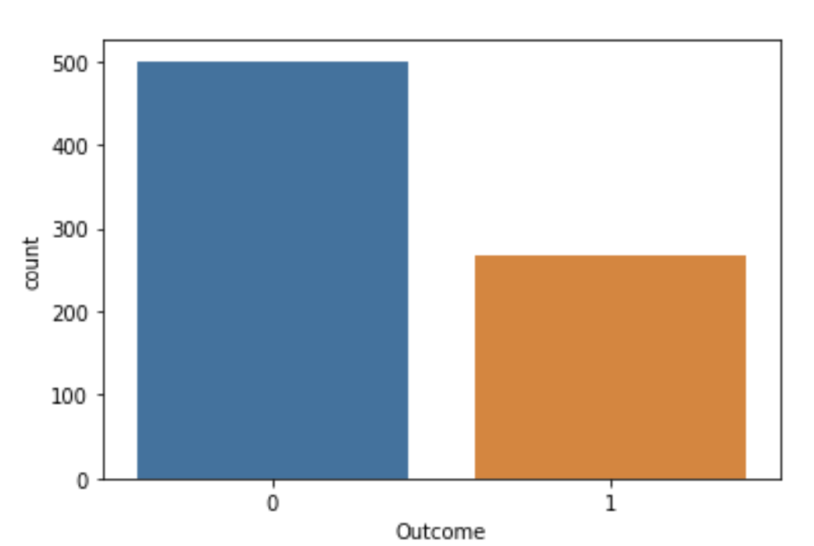
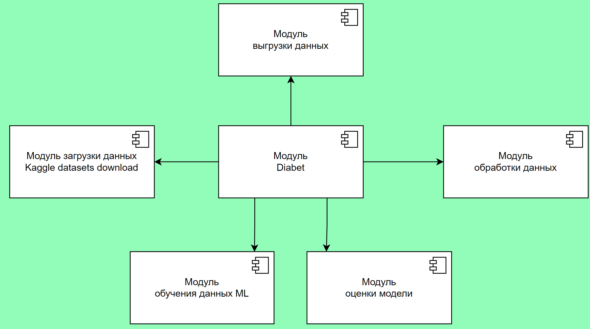

# Diabet
____
## Цель
____
> Повысить точность предсказания наличия у пациента диабета
на основе определенных диагностических измерений.
## Задачи
____
1. - [ ] анализ существующих решений.
2. - [ ] сбор данных и их обновление.
3. - [ ] обучение и оценка моделей на исходном датасете.
4. - [ ] выбор двух моделей с наибольшим значением точности.
5. - [ ] оценка качества и скорости работы модели на новых данных путем A / B тестирования.
6. - [ ] выбор и развертывание наилучшей модели.
## [Датасет](https://www.kaggle.com/datasets/akshaydattatraykhare/diabetes-dataset?select=diabetes.csv)
____

## Целесообразность
____
О наборе данных
Этот набор данных первоначально был получен из Национального института диабета, заболеваний органов пищеварения и почек. Цель набора данных состоит в том, чтобы диагностически предсказать, есть ли у пациента диабет, на основе определенных диагностических измерений, включенных в набор данных. На выбор этих экземпляров из более крупной базы данных было наложено несколько ограничений. В частности, все пациенты здесь - женщины в возрасте не менее 21 года, имеющие индейское происхождение пима.2
Из набора данных в файле (.csv) мы можем найти несколько переменных, некоторые из них независимы (несколько медицинских предикторных переменных) и только одна целевая зависимая переменная (исход).

Переведено с помощью [https://translate.yandex.ru/](https://translate.yandex.ru/)

[Обзор датасета](https://www.kaggle.com/datasets/akshaydattatraykhare/diabetes-dataset?select=diabetes.csv)

Можно посмотреть на количество диагнозов:
0    500 (не болеет диабетом)
1    268 (болеет диабетом) 

____
### Component diagram

### Activity diagram

